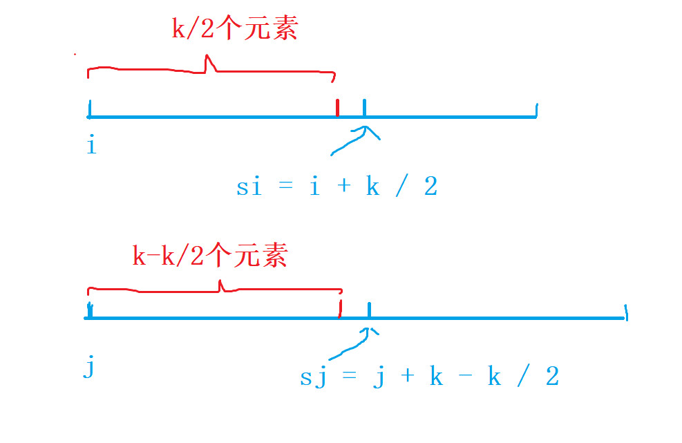

给定两个大小为 m 和 n 的正序（从小到大）数组 `nums1` 和 `nums2`。请你找出并返回这两个正序数组的中位数。

**进阶：**你能设计一个时间复杂度为 `O(log (m+n))` 的算法解决此问题吗

```java

/*
 * @lc app=leetcode.cn id=4 lang=java
 *
 * [4] 寻找两个正序数组的中位数
 */

// @lc code=start
class Solution {
    public double findMedianSortedArrays(int[] nums1, int[] nums2) {
     int total = nums1.length+nums2.length;
     if(total%2==0){
        int left= f(nums1,0,nums2,0,total/2);
        int right=f(nums1,0,nums2,0,total/2+1);
        return (left+right)/2.0;
     }else{
            return f(nums1,0,nums2,0,total/2+1);
     }
    }
    //寻找第k小元素
    static int f(int[] nums1,int i,int[] nums2,int j,int k){
        //默认第一个数组是最小的
        if(nums1.length-i > nums2.length-j){
            return f(nums2,j,nums1,i,k);
        }
        //当第一个数组已经用完
        if(nums1.length==i){
            return nums2[j+k-1];
        }
        // 当取第一个元素
        if(k==1){
            return Math.min(nums1[i],nums2[j]);
        }

        int si= Math.min(nums1.length, i+k/2);
        int sj= j+k-k/2;
        if(nums1[si-1]>nums2[sj-1]){
            return f(nums1,i,nums2,sj,k-(sj-j));
        }else{
            return f(nums1,si,nums2,j,k-(si-i));
        }
    }
    
}


```

**算法分析**

给定两个有序的数组，找中位数`(n + m) / 2`，等价于找第`k`小的元素，`k = (n + m) / 2`

1、当一共有偶数个数时，找到第`total / 2`小`left`和第`total / 2 + 1`小`right`，结果是`(left + right / 2.0)`
		  2、当一共有奇数个数时，找到第`total / 2 + 1`小，即为结果

==如何找第`k`小==



  1、默认第一个数组比第二个数组的有效长度小
			2、第一个数组的有效长度从`i`开始，第二个数组的有效长度从`j`开始，其中`[i,si - 1]`是第.  					一个数组的前`k / 2个`元素，`[j, sj - 1]`是第二个数组的前`k - k / 2`个元素
			3、当`nums1[si - 1] > nums2[sj - 1]`时，则表示第`k`小一定在`[i,n]`与`[sj,m]`中
			4、当`nums1[si - 1] <= nums2[sj - 1`]时，则表示第`k`小一定在`[si,n]`与`[j,m]`中

时间复杂度 `O(n+m)`


参考链接：（三种解法）

https://leetcode-cn.com/problems/median-of-two-sorted-arrays/solution/xiang-xi-tong-su-de-si-lu-fen-xi-duo-jie-fa-by-w-2/

